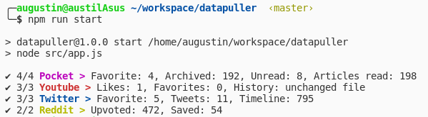

# Data Puller




This repository is a collection of script I've made to conveniently pull my personnal data from internet services I use the most.  
The goal is to get everything about me in one place for futher analysis (data science with R, full text search with Elastic, ...).

Those scripts pull every bit of interesting data about you available from web services APIs into plain JSON files.

Currently supporting :

- Pocket : unread, archived & favorites
- Twitter : likes, tweets, retweets
- Youtube : likes, favorites, history (via manual import & parsing)
- Reddit : upvoted, saved
- Github : stars

:hospital: Have a look at [The Data Detox Kit](https://datadetox.myshadow.org/en/detox).

## Run

```bash
# A specific puller (for setup or debug), e.g. twitter
node src/pullers/twitter_pull.js
# All puler at once
npm run start
```

## Setup

* Run `npm install`
* Provide your API Credentials via env variables or a `./config.json` file (have a look at `./src/config_manager.js`)
* Go through the auth procedure of every configured puller by launching them separatly
* Run all puller with `npm run start`

## More on this project

### Youtube Restrictions

The watch history and the watch later playlist are [not accessible](https://developers.google.com/youtube/v3/revision_history#september-15-2016) through the Youtube API for privacy reasons.  
To get arround this you can obtain a `watch-history.html` file via the [Google Takeout page](https://takeout.google.com/settings/takeout).
Then, put this file in the `drop_zone` folder so it can be parsed by the youtube puller on the next run.  
As for the watch later playlist, the Google Takeout export is already a JSON file.

Late 2019 update : the watch history is now available in JSON but still require pulling videos details.

### Why this project, Are website data exports not enough ?

Website's export feature have shortcomings (late 2019) :

- Pocket export is in html and does not differenciate favorite from other items
- Github export does not include starred repos
- Youtube export does not include any videos metadata like duration and category

As for Facebook, Reddit and Twitter, they're doing a great job so my scripts are kind of irrelevant.
